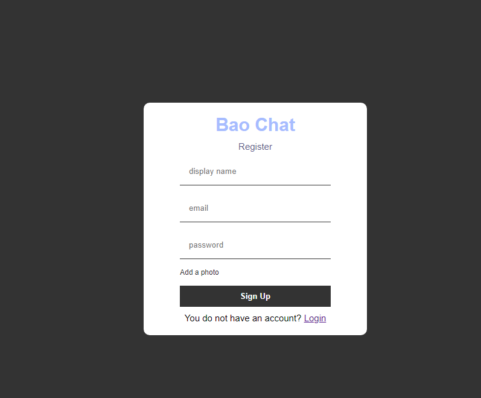
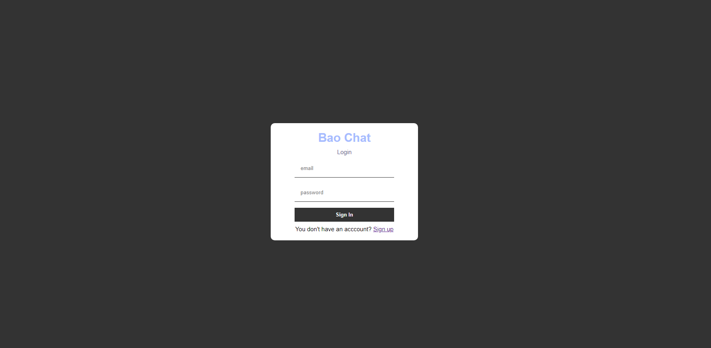
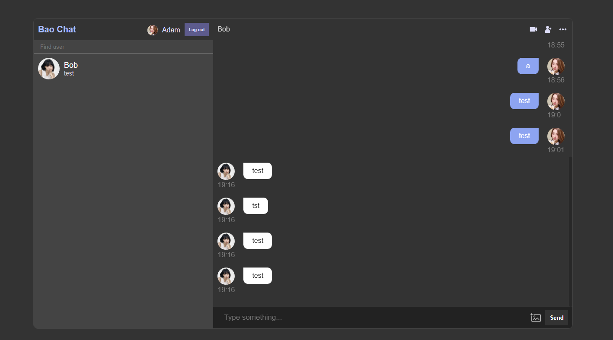
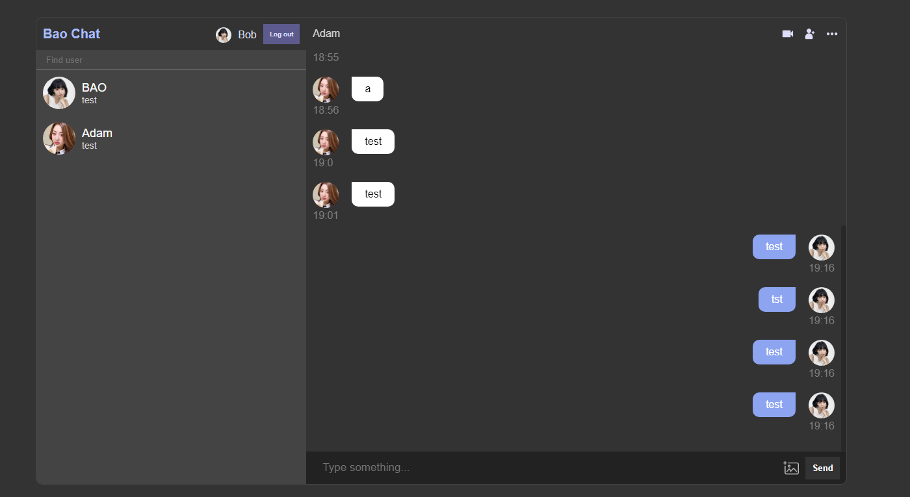

### Summary

This app implements a real time chat application. Users can register or login and search other users and message them in real time.

### Technologies

- ReactJS
- react-router-dom
- CSS
- Firebase

### Features

- Responsive design
- User Authentication
- Error Handling
- Real time messaging
- Able to send images

### Screenshots

#### Register

#### Login

#### User 1

#### User 2

